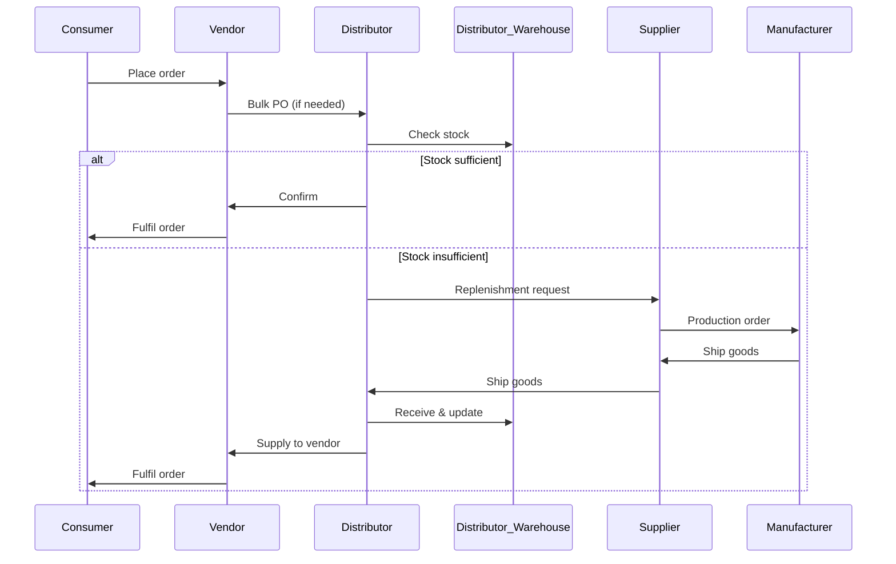

# 📘 Smart Multi-Tenant Supply & CRM Platform

## 🏢 Project Overview

**Scope:**  
End-to-end multi-tenant CRM + Order & Supply Chain platform connecting:

- Super Admin (Platform Owner)
- Manufacturers (Tenant Admins)
- Suppliers
- Distributors (1 warehouse each)
- Vendors
- Consumers (End Users)

The system manages:

- CRM (Accounts, Contacts, Tickets)
- Product Catalog
- Multi-Level Pricing & Margins
- Inventory & Warehouse
- Negotiations & Quotes
- Orders & Fulfillment
- Full Audit Trail

---

# 🎯 Objectives

## Primary Objective
Build a scalable SaaS platform enabling manufacturers to manage their complete supply network with strict pricing governance.

## Success Criteria

- Support multiple manufacturers (strict tenant isolation)
- Handle 10k+ concurrent consumers
- End-to-end order traceability
- Configurable pricing & margin engine
- Complete audit trail

---

# 🏗 Multi-Tenancy Model

## Tenant Hierarchy

Level 0: Super Admin  
Level 1: Manufacturer (Tenant)  
Level 2+: Supplier → Distributor → Vendor → Consumer  

All entities belong to exactly one tenant.

## Isolation Rules

- All tables include `tenant_id`
- No cross-tenant access
- Strict RBAC enforcement

---

# 👥 Roles

- SuperAdmin
- ManufacturerAdmin
- SupplierUser
- DistributorUser
- VendorUser
- Consumer

Permissions scoped by:
- Catalog
- Pricing
- Inventory
- Orders
- CRM
- Reports

---

# 🧱 Core Domain Entities

## Tenant
- tenant_id
- name
- branding
- currency
- locale

## OrganizationUnit
- org_unit_id
- tenant_id
- type (SUPPLIER | DISTRIBUTOR | VENDOR)

## Warehouse
- warehouse_id
- org_unit_id (Distributor only)

## Product
- product_id
- tenant_id
- SKU
- base_unit
- base_price

## MarginRule
- level
- min_margin
- max_margin

## Inventory
- warehouse_id
- product_id
- quantity_on_hand
- reserved_quantity
- safety_stock

## Order
- order_id
- type
- status
- from_org
- to_org

## OrderLine
- product_id
- quantity
- unit_price
- margin_snapshot

## Quote
- status (DRAFT | SENT | COUNTERED | ACCEPTED | REJECTED | EXPIRED)

---

# 💰 Pricing & Margin Engine

Let:

P_M = Manufacturer Base Price  
m_S = Supplier Margin  
m_D = Distributor Margin  
m_V = Vendor Margin  

Supplier Price:
```
P_S = P_M × (1 + m_S)
```

Distributor Price:
```
P_D = P_S × (1 + m_D)
```

Vendor Price:
```
P_V = P_D × (1 + m_V)
```

### Validation Rules

- Must stay within configured margin range
- No negative margins (unless allowed)
- Margin snapshot stored per order line
- Approval workflow for overrides

---

# 📦 Order Flow (Simplified)

Consumer → Vendor  
Vendor → Distributor  
Distributor → Supplier  
Supplier → Manufacturer  

Warehouse inventory updated via:

- GRN (Goods Received Note)
- GIN (Goods Issue Note)
- Adjustments

---

# 🔁 Negotiation Workflow

States:

- DRAFT
- SENT
- COUNTERED
- ACCEPTED
- REJECTED
- EXPIRED

Rules:

- Each counter validated against margin constraints
- Approval required if outside allowed range
- Full audit logging

---

# 📊 CRM Features

- Accounts
- Contacts
- Activities
- Opportunities
- Tickets
- Escalation across levels

---

# ⚙ Functional Modules

## Super Admin
- Tenant management
- Subscription plans
- Global configs
- Platform monitoring

## Manufacturer
- Network onboarding
- Product & pricing management
- Margin policies
- Reporting

## Supplier
- Replenishment handling
- PO to manufacturer
- Quote generation

## Distributor
- Single warehouse management
- Inventory tracking
- Vendor pricing
- Reorder automation

## Vendor
- Consumer catalog
- Checkout system
- Bulk ordering to distributor

## Consumer
- Browse
- Order
- Track
- Support

---

## Sequence Diagram

# 🚀 Release Phases

## Phase 1 
- Multi-tenant structure
- Basic pricing engine
- Core order flow
- Inventory management
- Basic CRM

## Phase 2
- Advanced negotiations
- Approval workflows
- Campaign engine
- Advanced CRM

## Phase 3
- ERP integrations
- Multi-currency
- Dynamic pricing
- Advanced analytics

---

# 🔐 Non-Functional Requirements

## Security
- RBAC
- Tenant isolation
- Audit logs
- HTTPS encryption

## Performance
- Product listing < 2s
- Checkout < 3s

## Reliability
- 99.5% uptime target
- Graceful degradation

---

# 📌 Assumptions

- Single currency per tenant (MVP)
- One warehouse per distributor
- Vendors act as sales nodes (no warehouse initially)
- Consumer pays vendor directly
- Revenue sharing outside MVP scope

---

# 📎 Architecture (Conceptual)

Client Apps:
- Super Admin Portal
- Manufacturer Portal
- Supplier Portal
- Distributor Portal
- Vendor Portal
- Consumer App

Core Services:
- API Gateway
- Auth Service
- Tenant Service
- Product Service
- Order Service
- Inventory Service
- CRM Service
- Notification Service

Database:
- Logical Multi-Tenant DB
- All tables scoped by `tenant_id`

---


  ###  A. Create Products (Catalog)

  Where: Manufacturer Panel → Products
  Fields to fill:

  - Manufacturer (organization)
  - Name
  - SKU
  - Brand
  - Category
  - Price (cents)
  - Active
  - Description

  Who can update? Manufacturer only
  Why important? Products are consumed by organizations for purchase orders.

  ———

  ### B. Define BOM (Bill of Materials)

  Where: BOM Items
  Fields:

  - Product
  - Raw Material
  - Quantity Required

  Who can update? Manufacturer only
  Purpose: Defines materials needed to produce one product.

  ———

  ### C. Production Orders

  Where: Production Orders
  Fields:

  - Product
  - Order Number
  - Quantity Planned
  - Quantity Completed
  - Status (Draft → In Production → Completed)
  - Start/Completed date

  Who can update? Manufacturer
  Flow: This is the production tracking unit.

  ———

  ### D. Inventory Monitoring

  Where: Inventory Items
  Fields:

  - Product
  - Quantity on Hand
  - Reorder Threshold

  Who can update? Manufacturer
  Used for: Stock monitoring & reorder alerts.

  ———

  ### E. Supplier Management

  Where: Suppliers

  - Add suppliers or invite in org panel (depending on flow)
  - Tracks supplier status

  ———

  ### F. Purchase Orders (Raw materials)

  Where: Purchase Orders
  Fields:

  - Buyer (manufacturer org)
  - Supplier (supplier org)
  - Order Number
  - Status
  - Total Amount

  Who updates? Manufacturer
  Purpose: Orders raw materials from suppliers.

  ———

  ### G. Dispatch Orders (Outbound)

  Where: Dispatch Orders
  Fields:

  - PO
  - Dispatch Number
  - Status
  - Dispatched Date

  Who updates? Manufacturer
  Purpose: Shipment to buyer organizations.

  ———

  ### H. Quality Reports

  Where: Quality Reports
  Fields:

  - Production Order
  - Status (Passed/Failed)
  - Inspection Date
  - Notes

  ———

  # 2) Organization Demo (Buyer Panel)

  ### A. View Products

  Where: Products
  Shows manufacturer’s catalog.

  ———

  ### B. Create Purchase Order

  Where: Purchase Orders
  Fields:

  - Buyer (auto locked to this org)
  - Supplier (list of suppliers only)
  - Order Number
  - Status (Draft → Submitted → Approved → In Production → Dispatched → Delivered → Completed)
  - Total Amount

  Who can update? Organization Admin
  Flow: This order becomes visible to supplier.

  ———

  ### C. GRN (Goods Receipt Note)

  Where: GRN
  Fields:

  - PO
  - Received By
  - Received Date
  - Status

  ———

  ### D. Invoices

  Where: Invoices
  Fields:

  - PO
  - Invoice Number
  - Amount
  - Tax
  - Due Date
  - Status (Pending/Paid/Overdue)

  ———

  ### E. Payments

  Where: Payments
  Fields:

  - Invoice
  - Amount Paid
  - Mode
  - Transaction Ref
  - Status

  ———

  ### F. Users (Organization Members)

  Where: Users
  Role options only:

  - organization_admin
  - supplier

  Email is locked on edit

  ———

  # 3) Supplier Demo (Supplier Panel)

  ### A. RFQ Inbox

  Where: RFQs
  Fields:

  - Buyer
  - Supplier (auto locked)
  - RFQ Number
  - Status
  - Due Date

  ———

  ### B. Quotations

  Where: Quotations
  Fields:

  - RFQ
  - Total Amount
  - Status (Submitted / Accepted / Rejected)

  ———

  ### C. Purchase Orders

  Where: Purchase Orders

  - Shows buyer’s POs

  ———

  ### D. Shipments

  Where: Shipments
  Fields:

  - PO
  - Tracking Number
  - Status
  - Shipped / Delivered date

  ———

  ### E. Invoices & Payments

  Same as organization panel, but supplier views only their invoices/payments.

  ———

  # Internal Communication (How data travels)

  ### Example flow:

  1. Manufacturer creates product → visible to organization.
  2. Organization creates PO → Supplier sees it.
  3. Supplier ships + invoices → Organization records GRN + payment.
  4. Manufacturer sees dispatch + revenue data.

  ### Key internal links

  - purchase_orders connect buyer ↔ supplier
  - invoices connect to PO
  - payments connect to invoice
  - rfqs connect buyer ↔ supplier
  - quotations connect to RFQ

  ———

  # Who Can Update What

  | Module | Can Update |
  |--------|-------------|
  | Manufacturer | Products, BOM, Production, Inventory, Purchase Orders, Dispatch, Quality |
  | Organization | Purchase Orders, GRN, Inventory, Invoices, Payments |
  | Supplier | RFQ, Quotation, Shipments, Invoices |

  ———

